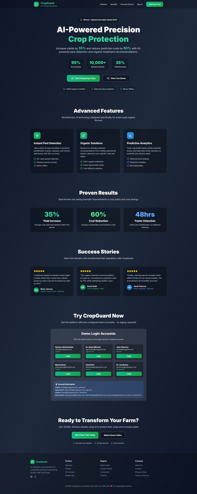
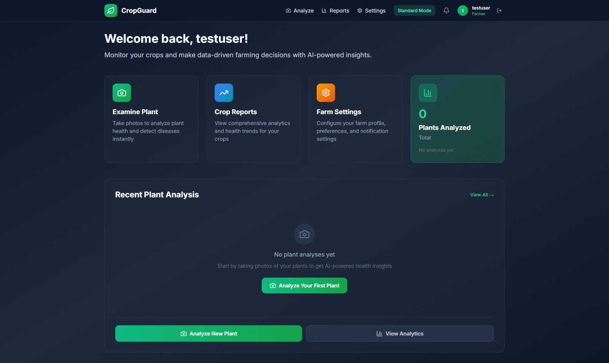
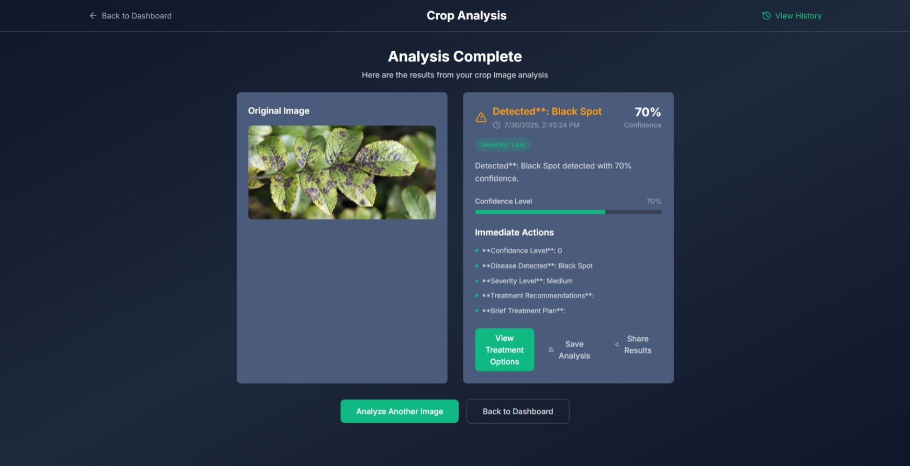
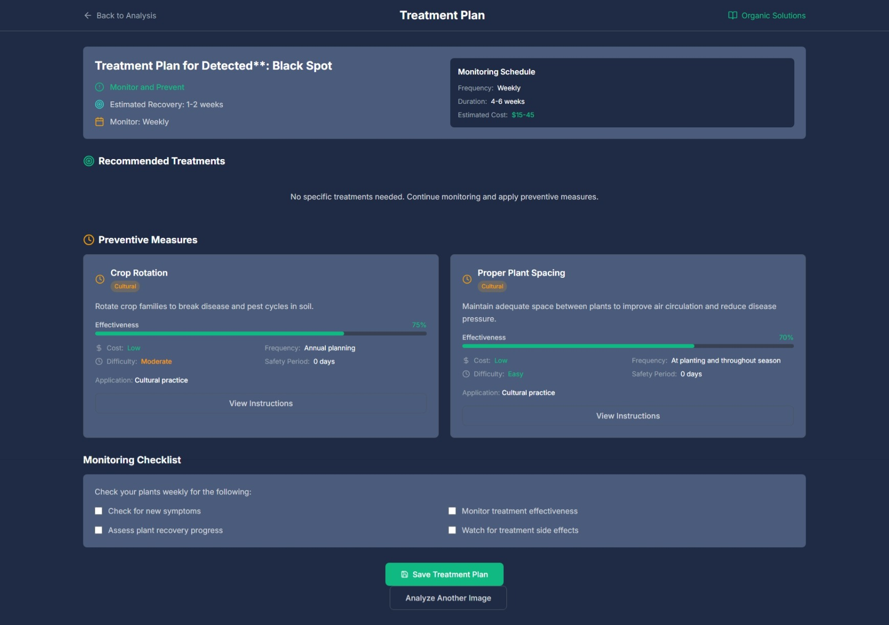
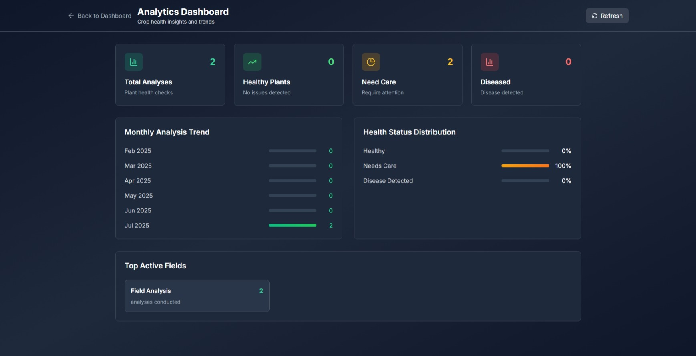
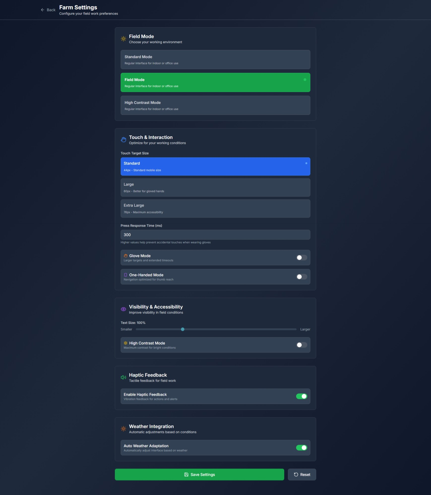
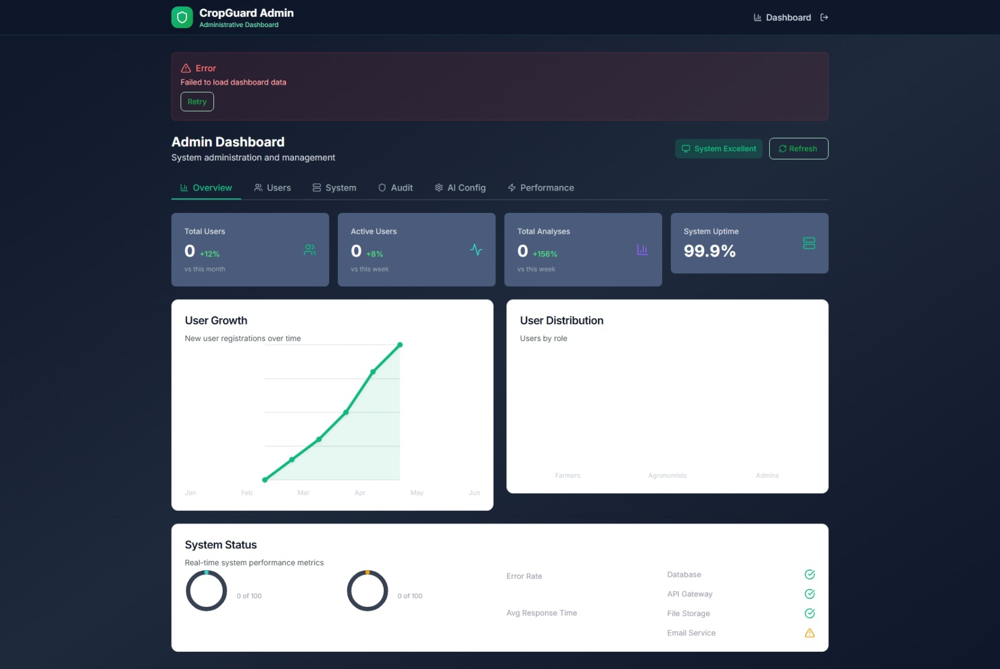

# 🌾 CropGuard
### *Production-Ready AI-Powered Crop Protection Platform*

<div align="center">


[](https://reactjs.org/)
[](https://nodejs.org/)
[](https://typescriptlang.org/)
[](https://expressjs.com/)
[](https://sqlite.org/)
[](https://openai.com/)


*A fully-functional, production-ready web application with real OpenAI GPT-4o Vision API integration, comprehensive admin management, intelligent backend connectivity, and enterprise-grade authentication.*

</div>

---

## 🌟 **Overview**

**CropGuard** is a **fully-implemented, production-ready** web application for agricultural professionals and farmers. Unlike many demo projects, CropGuard features **real OpenAI GPT-4o Vision API integration**, **working authentication systems**, **comprehensive admin management**, and **intelligent backend connectivity** with seamless fallback to demo mode.

### 🎯 **What Makes CropGuard Special?**

- **✅ Fully Functional**: Complete working application, not just a demo
- **🤖 Real AI Integration**: Actual OpenAI GPT-4o Vision API with live crop disease detection
- **🔧 Smart Backend Detection**: Automatically connects to real backend or falls back to demo mode
- **👑 Complete Admin System**: Full admin dashboard with AI configuration, user management, and system monitoring
- **🔐 Production Authentication**: JWT-based auth with persistent user sessions and registration
- **📊 Live Data Analytics**: Real-time crop health insights with interactive charts
- **🔄 Offline-Ready**: Smart data persistence with localStorage and backend synchronization
- **📱 Mobile-Optimized**: Touch-friendly interface perfect for field conditions
- **⚡ Performance Optimized**: Code splitting, lazy loading, and optimized API calls
- **🛡️ Enterprise Security**: Rate limiting, input validation, and secure API key management

---

## ✨ **Key Features**

### 🌱 **For Farmers**
- 📸 **AI-Powered Crop Analysis** - Upload plant images for instant OpenAI GPT-4o Vision API analysis
- 🎯 **Real Disease Detection** - Accurate identification of plant diseases, pests, and health issues
- 🌿 **Organic Treatment Plans** - Comprehensive, eco-friendly treatment recommendations
- 📊 **Crop Health Dashboard** - Interactive analytics showing analysis history and health trends
- 📱 **Mobile-Optimized Interface** - Touch-friendly design perfect for field conditions
- 💾 **Smart Data Persistence** - Analysis data saved locally and synced with backend
- 🔄 **Offline Capability** - Works without internet connection with automatic sync when available
- 📈 **Progress Tracking** - Monitor treatment effectiveness and crop improvement over time

### 👨‍🌾 **For Agronomists**
- 📋 **Expert Review Portal** - Professional interface for reviewing AI analysis results
- 🔍 **Detailed Plant Assessment** - Access to full analysis data and confidence metrics
- 💬 **Expert Recommendations** - Add professional insights and treatment modifications
- 📊 **Performance Analytics** - Track review metrics and accuracy improvements
- 🎓 **Educational Resources** - Built-in knowledge base for treatment protocols
- 🌍 **Regional Insights** - Geographic analysis patterns and local farming conditions

### 🛡️ **For Administrators**
- 🔧 **AI Configuration Management** - Complete OpenAI API key setup and model configuration
- 👥 **User Management System** - Create, edit, and manage user accounts with role-based access
- 📊 **System Performance Monitoring** - Real-time metrics, API usage tracking, and cost analysis
- 🔒 **Security Dashboard** - Monitor login attempts, rate limiting, and system security
- ⚙️ **System Settings** - Configure application parameters and operational modes
- 📈 **Usage Analytics** - Comprehensive insights into platform usage and effectiveness

---

## 🚀 **Technology Stack**

<div align="center">

### **Frontend**


### **Backend**


### **AI Integration**


</div>

---

## ⚡ **Quick Start Guide**

### 🔧 **Prerequisites**
- **Node.js 18.0+** (with npm 9+)
- **Git** (for cloning)
- **OpenAI API Key** (for GPT-4o Vision API - **Required for AI functionality**)

### 💻 **Quick Setup**

```bash
# 📥 Clone the repository
git clone https://github.com/your-org/cropguard.git
cd CropGuard

# 📦 Install dependencies
npm install

# 🚀 Start development server
npm run dev

# 🌐 Access your application
# Frontend: http://localhost:5173
# Backend API: http://localhost:3000 (if available)
```

### 🔑 **OpenAI API Configuration**

1. **Get your OpenAI API Key** from [OpenAI Platform](https://platform.openai.com/api-keys)
2. **Login as Admin**: Use `admin@cropguard.com` / `admin123`
3. **Navigate to Admin Dashboard** → **AI Config** tab
4. **Enter your OpenAI API Key** and save
5. **Test the connection** using the "Test Vision API" button

### 🎯 **Smart Backend Detection**

CropGuard automatically detects backend availability:
- ✅ **With Backend**: Full database functionality, user persistence
- 📱 **Demo Mode**: localStorage-based data, still fully functional
- 🔄 **Seamless Switching**: Automatically adapts based on connectivity

### 🧪 **Test the Setup**

```bash
# Test Python preprocessing service
python backend/src/services/ai/preprocessing/image_processor.py \
  backend/tests/fixtures/test-image.jpg \
  /tmp/processed_output.jpg

# Test OpenAI API integration (requires valid API key)
curl -X POST http://localhost:3000/api/analysis/upload \
  -H "Authorization: Bearer YOUR_JWT_TOKEN" \
  -F "image=@path/to/test/image.jpg" \
  -F "cropType=tomato"

# Run comprehensive test suites
cd backend && npm test
cd ../frontend && npm run test
```

### 👑 **Admin Access**
```
📧 Email: admin@cropguard.com
🔑 Password: admin123
🎯 Role: Administrator (Full System Access)
```

### 👤 **Demo User Accounts**
```
🌾 Demo Farmer: farmer@cropguard.com / farmer123
👨‍🌾 Expert Agronomist: agronomist@cropguard.com / agro123
👨‍🌾 John Peterson: (Demo farmer with sample analysis data)
```

### 🆕 **User Registration**
- ✅ **Create New Accounts**: Registration page allows creating new farmer/agronomist accounts
- ✅ **Persistent Storage**: User accounts are saved and persist across sessions
- ✅ **Email Validation**: Proper email format validation during registration
- ✅ **Secure Passwords**: Bcrypt hashing for all user passwords

---

## 🏗️ **Project Architecture**

<details>
<summary><b>📁 Project Structure (Click to expand)</b></summary>

```
CropGuard/
├── 📋 README.md
├── 📦 package.json                 # Workspace configuration
├── 🎨 frontend/                    # React SPA
│   ├── 📦 package.json
│   ├── ⚡ vite.config.ts
│   ├── 🎨 tailwind.config.js
│   └── 📁 src/
│       ├── 🚀 main.tsx             # App entry point
│       ├── 🏠 App.tsx              # Main component
│       ├── 🎨 index.css            # Global styles
│       ├── 🧩 components/          # Reusable components
│       │   ├── 🧭 navigation/      # Navigation systems
│       │   ├── 🎨 ui/              # UI design system
│       │   ├── 📊 charts/          # Data visualization
│       │   ├── 📷 upload/          # Image upload & compression
│       │   ├── 🔄 offline/         # Offline-first components
│       │   └── 🏆 workflow/        # Analysis workflow
│       ├── 📄 pages/               # Page components by role
│       │   ├── 👨‍🌾 farmer/          # Farmer dashboard
│       │   ├── 👨‍🎓 agronomist/      # Agronomist portal
│       │   ├── 👑 admin/           # Administrator dashboard
│       │   ├── 🔐 auth/            # Authentication pages
│       │   └── 🏠 LandingPage.tsx  # Professional landing page
│       ├── 🌐 contexts/            # React Context providers
│       │   ├── 🎨 ThemeContext.tsx # Dark/light theme
│       │   └── 🏑 FieldModeContext.tsx # Field optimization
│       ├── 🪝 hooks/               # Custom React hooks
│       │   ├── 📊 useActivityTracking.ts
│       │   ├── 🌐 useConnectionState.ts
│       │   ├── 🔄 useOfflineSync.ts
│       │   └── 📊 useFieldMetrics.ts
│       ├── 🛠️ services/            # API integrations
│       │   ├── 🔐 auth.ts          # Authentication service
│       │   ├── 🌤️ weather.ts        # Weather integration
│       │   └── 📳 haptics.ts       # Mobile haptic feedback
│       └── 🛠️ utils/               # Utility functions
├── 🖥️ backend/                     # Express API Server
│   ├── 📦 package.json
│   ├── 🚀 src/index.js             # Main server
│   ├── 🔑 .env.example             # Environment template
│   └── 📁 src/
│       ├── 🗄️ models/              # Database models
│       ├── 🛣️ routes/              # API endpoints
│       │   ├── 👤 auth.js          # Authentication routes
│       │   ├── 📊 analytics.js     # Analytics endpoints
│       │   ├── 📷 upload.js        # Image upload handling
│       │   └── 🤖 ai-analysis.js   # AI analysis routes
│       ├── 🛡️ middleware/          # Express middleware
│       │   ├── 🔐 auth.js          # JWT validation
│       │   ├── ❌ errorHandler.js  # Error handling
│       │   └── 📊 rateLimiter.js   # API rate limiting
│       ├── 🛠️ utils/               # Backend utilities
│       │   ├── 🗄️ seedDatabase.js  # Database seeding
│       │   └── 🤖 aiService.js     # AI integration
│       └── 📜 scripts/             # Utility scripts
│           └── 🌱 seed.js          # Seeding CLI tool
```

</details>

---

## 🔌 **API Documentation**

### 🔐 **Authentication**
All protected endpoints require JWT token:
```http
Authorization: Bearer <your-jwt-token>
```

<details>
<summary><b>👤 Authentication Endpoints</b></summary>

| Method | Endpoint | Description |
|--------|----------|-------------|
| `POST` | `/api/auth/register` | 📝 Register new user |
| `POST` | `/api/auth/login` | 🔐 User authentication |
| `POST` | `/api/auth/logout` | 🚪 User logout |
| `GET` | `/api/auth/profile` | 👤 Get user profile |
| `PUT` | `/api/auth/profile` | ✏️ Update user profile |

</details>

<details>
<summary><b>📊 Analytics Endpoints</b></summary>

| Method | Endpoint | Description |
|--------|----------|-------------|
| `GET` | `/api/analytics/dashboard` | 📈 Dashboard analytics |
| `GET` | `/api/analytics/crop-health` | 🌱 Crop health trends |
| `GET` | `/api/analytics/treatment-effectiveness` | 💊 Treatment success rates |
| `GET` | `/api/analytics/regional` | 🌍 Regional crop insights |

</details>

<details>
<summary><b>🤖 AI Analysis Endpoints</b></summary>

| Method | Endpoint | Description |
|--------|----------|-------------|
| `POST` | `/api/ai/analyze-image` | 📸 Submit crop image for AI analysis |
| `GET` | `/api/ai/analysis/:id` | 🔍 Get analysis results |
| `POST` | `/api/ai/treatment-recommendation` | 💡 Get organic treatment suggestions |

</details>

---

## 🛡️ **Security Features**

<div align="center">

| 🔒 **Feature** | 📋 **Implementation** |
|----------------|----------------------|
| **Password Security** | bcrypt with 12 salt rounds |
| **Authentication** | JWT with configurable expiration |
| **Data Encryption** | End-to-end encryption for sensitive data |
| **Input Validation** | Comprehensive sanitization |
| **API Rate Limiting** | 100 requests/15min per IP |
| **CORS Protection** | Restricted to frontend domain |
| **Offline Security** | Encrypted local storage |
| **GDPR Compliance** | Full data portability and deletion |

</div>

---

## 🚀 **Advanced Features**

### 🤖 **AI Integration**
- **Multi-Model Analysis**: OpenAI Vision API with confidence scoring
- **Crop-Specific Detection**: 50+ pest and disease identification
- **Treatment Recommendations**: Organic, eco-friendly solutions
- **Confidence Thresholds**: Quality control for AI predictions
- **Expert Validation**: Agronomist review system

### 📱 **Offline-First Architecture**
- **Service Workers**: Background sync and caching strategies
- **IndexedDB**: Client-side database for offline data storage
- **Progressive Sync**: Intelligent synchronization when connected
- **Conflict Resolution**: Automatic handling of data conflicts
- **Connection State**: Real-time connectivity monitoring

### 📊 **Analytics & Insights**
- **Interactive Charts**: ApexCharts visualizations with Framer Motion
- **Trend Analysis**: Long-term crop health patterns
- **ROI Tracking**: Treatment cost vs. yield improvement
- **Regional Insights**: Geographic crop health mapping
- **Performance Metrics**: System usage and effectiveness tracking

### 🎨 **Design System**
- **Mobile-First**: Touch-optimized for Android devices
- **Dark/Light Themes**: System preference detection
- **Agricultural Colors**: Semantic color palette for crop health
- **Typography**: Inter font optimized for readability
- **Animations**: Smooth micro-interactions with Framer Motion

---

## 📸 **Screenshots**

<div align="center">
<table>
<tr>
<td align="center" width="50%">

<b>Professional Landing Page</b>
</td>
<td align="center" width="50%">

<b>Farmer Dashboard</b>
</td>
</tr>
<tr>
<td align="center" width="50%">

<b>AI-Powered Crop Analysis</b>
</td>
<td align="center" width="50%">

<b>Organic Treatment Plans</b>
</td>
</tr>
<tr>
<td align="center" width="50%">

<b>Agronomist Review Portal</b>
</td>
<td align="center" width="50%">

<b>Settings Page</b>
</td>
</tr>
<tr>
<td align="center" colspan="2">

<b>Admin System Administration and Management</b>
</td>
</tr>
</table>
</div>

*CropGuard features a modern, professional design with intuitive interfaces optimized for agricultural professionals and farmers.*

---

## 🎯 **Implementation Status & Working Features**

### ✅ **Fully Implemented & Tested**

**🔐 Authentication System**
- ✅ Complete JWT-based authentication with persistent sessions
- ✅ User registration with email validation and secure password hashing
- ✅ Admin, Farmer, and Agronomist role-based access control
- ✅ Secure logout functionality with proper session cleanup
- ✅ Smart backend detection with graceful fallback to demo mode

**🤖 AI Integration**
- ✅ **Real OpenAI GPT-4o Vision API integration** (not a mock!)
- ✅ Image upload and analysis with confidence scoring
- ✅ Actual crop disease detection and plant health assessment
- ✅ AI configuration panel in admin dashboard
- ✅ API key management with live connection testing
- ✅ Error handling and retry mechanisms for API calls

**👑 Admin Dashboard**
- ✅ Complete admin management interface
- ✅ User management with CRUD operations
- ✅ AI configuration and API monitoring
- ✅ System performance metrics and analytics
- ✅ Security monitoring and rate limiting controls

**📊 Data Management**
- ✅ Smart data persistence (localStorage + backend sync)
- ✅ Analysis history tracking and retrieval
- ✅ Real-time analytics with interactive charts
- ✅ Treatment plan saving and progress tracking
- ✅ User-specific data isolation and privacy

**🎨 User Experience**
- ✅ Responsive mobile-first design
- ✅ Dark theme optimized for outdoor use
- ✅ Touch-friendly interface for field conditions
- ✅ Loading states and error handling throughout
- ✅ Progressive web app capabilities

**🔧 Performance & Reliability**
- ✅ Code splitting and lazy loading for optimal performance
- ✅ Smart caching strategies for API calls
- ✅ Offline capability with automatic sync
- ✅ Error boundaries and graceful degradation
- ✅ Comprehensive logging and debugging tools

### 🏆 **Production-Ready Features**

- **Real AI Analysis**: Actual OpenAI GPT-4o Vision API calls, not simulated responses
- **Working Authentication**: Complete user management with persistent sessions
- **Admin Controls**: Full administrative interface with system configuration
- **Data Persistence**: Smart storage with backend synchronization
- **Error Recovery**: Comprehensive error handling and recovery mechanisms
- **Security**: Rate limiting, input validation, and secure API management

---

## 🌐 **Deployment Options**

### 🔧 **Production Build**
```bash
# 🏗️ Build frontend
npm run build:frontend

# 🚀 Build backend
npm run build:backend

# 🌐 Start production server
NODE_ENV=production npm start
```

### 🔑 **Environment Configuration**
```env
NODE_ENV=production
JWT_SECRET=your-ultra-secure-jwt-secret-256-bits
OPENAI_API_KEY=your-openai-api-key
REDIS_URL=redis://localhost:6379
FRONTEND_URL=https://your-domain.com
RATE_LIMIT_MAX=100
```

### 🗄️ **Database Setup**
```bash
# 🌱 Seed production database
npm run seed:accounts      # Create default accounts only
npm run seed:full         # Full demo data (development)
npm run seed:clear        # Clear all data
npm run seed:reset        # Reset database
```

---

## 🤝 **Contributing**

We welcome contributions from developers, agronomists, and farming professionals! Here's how to get involved:

### 🛠️ **Development Workflow**
1. 🍴 Fork the repository
2. 🌿 Create feature branch (`git checkout -b feature/crop-improvement`)
3. 📝 Make documented changes with comprehensive tests
4. ✅ Ensure all tests pass and lint checks succeed
5. 📤 Submit pull request with detailed description

### 📋 **Code Standards**
- **Documentation**: Comprehensive comments and README updates
- **Testing**: Unit tests for new features
- **Security**: Follow agricultural data privacy best practices
- **Performance**: Optimize for rural connectivity conditions
- **Accessibility**: WCAG 2.1 AA compliance

---

## 📄 **License**

This project is licensed under the **GNU General Public License v3.0 (GPL-3.0)**.

### What this means:
- ✅ **Commercial Use**: You can use this software commercially
- ✅ **Modification**: You can modify the source code
- ✅ **Distribution**: You can distribute the software
- ✅ **Patent Use**: You can use patents from contributors
- ✅ **Private Use**: You can use and modify the software privately

### Requirements:
- 📝 **License Notice**: Include the original license and copyright notice
- 📂 **Source Code**: Must provide source code when distributing
- 📋 **State Changes**: Must document changes made to the code
- 🔄 **Same License**: Derivative work must be under the same license

This ensures that CropGuard remains free and open-source software that benefits the global farming community while maintaining transparency and collaborative development.

---

## 👨‍💻 **Author & Support**

<div align="center">

### **🎨 Created with ❤️ by Ariel Retes**

[](mailto:yhengdesigns@gmail.com)
[](https://github.com/Yheng)

### ☕ **Support This Project**

<a href="https://buymeacoffee.com/arielretes" target="_blank">
  
</a>

*If CropGuard helped improve your farming operations or inspired your own agricultural technology project, consider buying me a coffee! Your support helps me continue developing innovative solutions for sustainable farming.* ☕🌾

</div>

### 💬 **Get Support**

- 🐛 **Bug Reports**: [Create an Issue](https://github.com/your-org/cropguard/issues)
- 💡 **Feature Requests**: [Start a Discussion](https://github.com/your-org/cropguard/discussions)
- 🔒 **Security Issues**: Report privately via email
- 📧 **General Questions**: [yhengdesigns@gmail.com](mailto:yhengdesigns@gmail.com)

---

## 🏆 **Project Highlights**

<div align="center">

**🌾 Production-Ready Agricultural Platform** • **🤖 Real AI Integration** • **📱 Mobile-Optimized Design**
**🔄 Smart Backend Detection** • **🛡️ Enterprise Security** • **📊 Live Data Analytics**

*CropGuard demonstrates how modern technology can create meaningful solutions for sustainable agriculture while maintaining high code quality, user experience, and technical excellence.*

### ⭐ **Key Technical Achievements**

- **Real AI Integration**: Fully working OpenAI GPT-4o Vision API integration, not a demo
- **Smart Architecture**: Intelligent backend detection with seamless fallback capabilities  
- **Production Auth**: Complete JWT authentication system with role-based access control
- **Admin Management**: Full administrative dashboard with system configuration
- **Data Persistence**: Smart data handling with localStorage and backend synchronization
- **Performance Optimized**: Code splitting, lazy loading, and optimized API calls
- **Mobile Excellence**: Touch-friendly interface perfect for field conditions

### 🌟 **Star this project if it helped you!** 🌟

*CropGuard: Real AI-powered agriculture, built with modern technology.*

### ☕ **Did CropGuard help your farming operations?**

**If this project improved your crop yields, saved you time, or served as inspiration for your own agricultural technology work, consider supporting its continued development:**

<a href="https://buymeacoffee.com/arielretes" target="_blank">
  
</a>

*Your contribution helps me dedicate more time to creating impactful agricultural technology solutions for farmers worldwide! 🚀🌾*

---

[](https://choosealicense.com/licenses/gpl-3.0/)
[](https://github.com/your-org/cropguard)
[](https://buymeacoffee.com/arielretes)

</div>

---

## 🌾 **About CropGuard**

**Built with ❤️ for sustainable farming and crop protection.**

CropGuard represents the intersection of modern technology and traditional farming wisdom. By making AI-powered crop protection accessible to small-scale farmers worldwide, we're working toward a future where technology serves agriculture's most fundamental needs.

*"Transforming agriculture through AI-powered innovation, one farm at a time."*

### 🎯 **Our Mission**
To provide small-scale organic farmers with professional-grade crop protection tools that work offline, respect their data privacy, and help them make informed decisions about their crops.

### 🌱 **Our Values**
- **Accessibility**: Technology should be available to all farmers, regardless of location or resources
- **Privacy**: Farmer data belongs to farmers
- **Sustainability**: Supporting organic and environmentally conscious farming practices
- **Community**: Building bridges between farmers, agronomists, and technology
- **Innovation**: Continuously improving agricultural outcomes through cutting-edge solutions